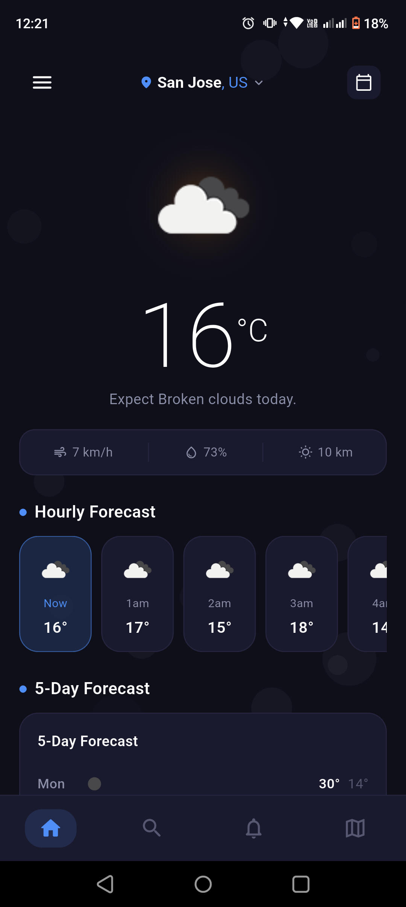
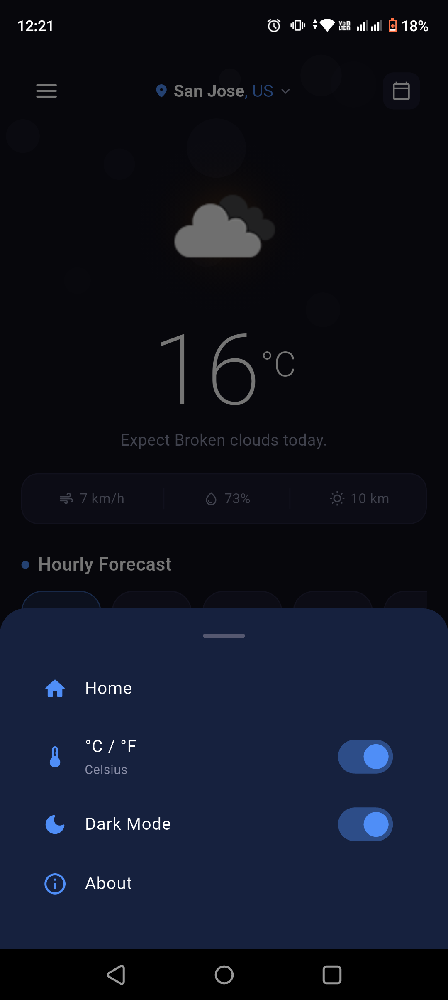
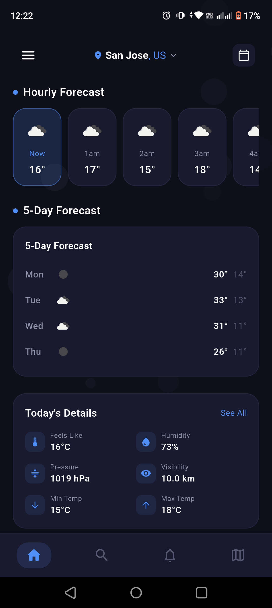
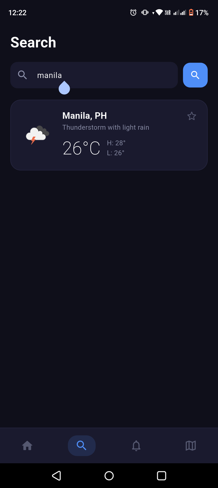
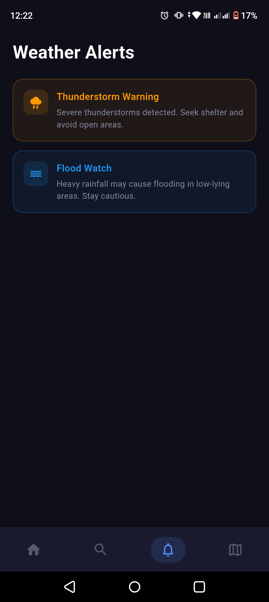
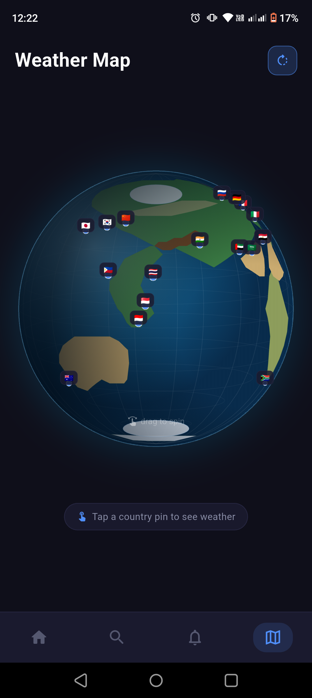

# Weather App

A Flutter weather application optimized for Realme C35 (Android 11, FHD+ 1080x2408, 20:9 aspect ratio).

## Features

- Live Weather - Current temperature, feels-like, humidity, wind speed, visibility, pressure, and cloud cover for any city
- Hourly & 5-Day Forecast - 6-hour lookahead and 5-day forecast with weather icons
- Interactive Globe - Animated 3D globe with draggable rotation and 25 country pins for instant weather lookup
- City Search - Search and save weather for any location worldwide
- Dynamic Weather Alerts - Auto-generated alerts based on real-time weather conditions (thunderstorm, flood, wind, snow, extreme heat, fog)
- Dark / Light Theme - Toggle between dark AMOLED-optimized and light themes
- Pull-to-Refresh - Swipe down to refresh weather data
- Offline Detection - Graceful error handling when no internet connection is available
- GPS Location - Automatically detects your current location on first launch
- Favorite Cities - Save multiple cities and swipe between them
- Responsive Design - Scales fluidly across screen sizes; locked to portrait orientation

## Screenshots

<table>
  <tr>
    <td></td>
    <td></td>
  </tr>
  <tr>
    <td></td>
    <td></td>
  </tr>
  <tr>
    <td></td>
    <td></td>
  </tr>
</table>

## Setup

1. Clone the repo
   ```
   git clone https://github.com/Bitr3e/Flutter_WeatherApp.git
   cd Flutter_WeatherApp
   ```

2. Get dependencies
   ```
   flutter pub get
   ```

3. Configure API key

   The app uses OpenWeatherMap's free API. Choose one of the following:

   Option A - Local config file (recommended):
   ```
   cp lib/constants/local_config.example.dart lib/constants/local_config.dart
   ```
   Then edit `lib/constants/local_config.dart` and add your key:
   ```dart
   const String apiKey = 'your_api_key_here';
   ```
   `local_config.dart` is gitignored so your key stays local.

   Option B - Build argument:
   ```
   flutter run --dart-define=WEATHER_API_KEY=your_api_key_here
   ```

   Get a free API key at https://openweathermap.org/api.

4. Run
   ```
   flutter run
   ```

## Build

Debug APK:
```
flutter build apk --debug
```

Release APK:
```
flutter build apk --release --split-per-abi
```

## Dependencies

- flutter - Material Design 3 UI framework
- http - REST API calls to OpenWeatherMap
- shared_preferences - Persist favorite cities, temperature unit, and theme preference
- geolocator - GPS location detection

## Project Structure

```
lib/
  constants/          Colors (dark/light), dimensions, config (API key, URLs)
  models/             WeatherData, HourlyForecast, DailyForecast data classes
  pages/
    home_page.dart    Main weather display with city navigation
    search_page.dart  City search and save
    alerts_page.dart  Dynamic weather-based alerts
    map_page.dart     Thin shell for globe feature
    map/              Globe painter, pins, country data, weather panel
  services/
    weather_service.dart     HTTP client for OpenWeatherMap
    temperature_service.dart Celsius / Fahrenheit toggle
    favorites_service.dart   Favorite cities persistence
    theme_service.dart       Dark / light theme toggle
    location_service.dart    GPS location
  utils/
    responsive.dart          Screen-size scaling
    connectivity.dart        Internet connectivity check
    forecast_generator.dart  Synthetic hourly forecast
    forecast_parser.dart     5-day forecast from API JSON
  widgets/            Reusable UI components (bottom nav, cards, hourly list, etc.)
```

## Developers

- John Brence Condesa
- Reymart Dela Cruz
- Carl Andre De Castro
- Scott Franklin Maher
